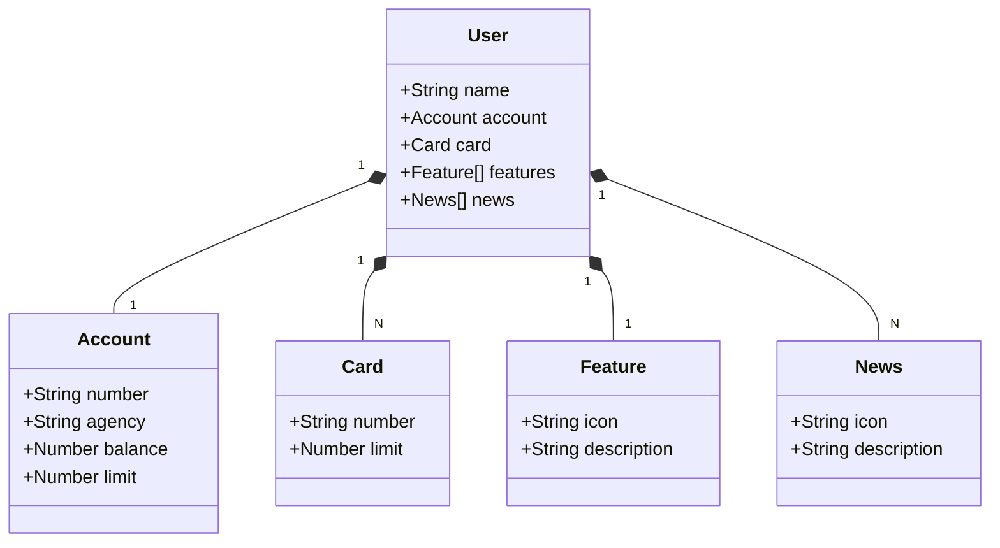

<h1 align="center">
  Internet Banking RESTful API
</h1>


## Class Diagram


## Technologies

- [Spring Boot](https://spring.io/projects/spring-boot)
- [Spring Web](https://spring.io/projects/spring-ws)
- [Spring Data JPA](https://spring.io/projects/spring-data-jpa)
- [SpringDoc OpenAPI 3](https://springdoc.org/v2/#spring-webflux-support)
- [H2 Database](https://www.h2database.com/html/main.html)
- [PostgreSQL](https://www.postgresql.org/)

## How To Run

```
git clone https://github.com/davidmateusreis/bank.git
```
```
./mvnw clean package -DskipTests
```
```
java -jar ./target/bank-0.0.1-SNAPSHOT.jar
```

## Environment

The project has been deployed on [Render](https://render.com) and the application can be accessed at this [link](https://backend-bank-1a50.onrender.com/swagger-ui/index.html).